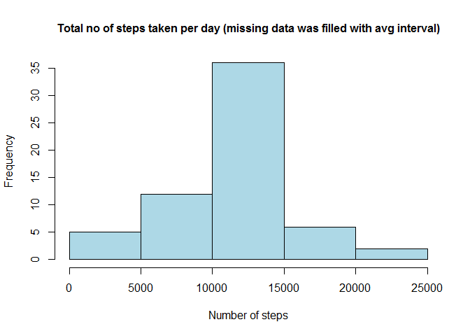

# Reproducible Research: Peer Assessment 1

library(knitr)
     
##Loading and preprocessing the data
####1. Load the data

```r
activity <- read.csv("activity.csv", header=TRUE, sep=",", na.string="NA")
```
####2. Process/transform the data

```r
activity_No_NA <- na.omit(activity)
activity_Is_NA <- activity[is.na(activity$steps),]
```
    

##Mean of total number of steps taken per day
####1. Histogram of the total number of steps taken each day

```r
NumOfSteps <- aggregate(steps ~ date, activity_No_NA, sum)
plot(NumOfSteps
     , type="h"
     , main ="Total no. of steps taken per day Oct-Nov 2012"
     , xlab="Date"
     , ylab="Number of steps")
```

 

####2.Calculate and report

```r
MeanOfSteps <- as.integer(mean(NumOfSteps$steps))
MedianOfSteps <- as.integer(median(NumOfSteps$steps))
```
The mean of total number of steps taken per day is 10766.
The median of total number of stpes taken per day is 10765.


##The average daily activity pattern
####1. Time series plot

```r
NumOfSteps2 <- aggregate(steps ~ interval, activity_No_NA, mean)
plot(NumOfSteps2
     , type="l"
     , main ="Time series plot of Oct-Nov 2012"
     , xlab="5-minute interval"
     , ylab="Average no. of steps taken") 
```

 

####2. Calculate and report 

```r
MaxStepsInterval <- NumOfSteps2[NumOfSteps2$steps == max(NumOfSteps2$steps),][[1]]
```
The 5-minute interval, on average across all the days in the dataset, contains the maximum number of steps is 835.  


##Imputing missing values
####1. Calculate and report

```r
NumOfNA <- sum(is.na(activity$steps))
```
The total number of missing values in the dataset is 2304 .

####2. Filling in all of the missing values

```r
activity_Is_NA$steps[activity_Is_NA$interval==NumOfSteps2$interval] <- NumOfSteps2$steps
```
####3. Create a new dataset that is equal to the originaldataset but with the missing data filled in

```r
activity2 <- rbind(activity_No_NA, activity_Is_NA)
```
####4. Make a histogram, calculate and report

```r
NumOfSteps2 <- aggregate(steps ~ date, activity2, sum)
plot(NumOfSteps2
     , type="h"
     , main ="Total no of steps taken per day (missing data was filled with avg interval)"
     , xlab="Date"
     , ylab="Number of steps")
```

 

```r
MeanOfSteps2 <- as.integer(mean(NumOfSteps2$steps))
MedianOfSteps2 <- as.integer(median(NumOfSteps2$steps))
```
The mean and median of total number of steps taken per day (missing data was filled with average interval value) are 10766 and 10766.  


##Differences in activity patterns between weekdays and weekends
####1. Create weekdays and weekends dataset

```r
NumOfSteps3 <- activity2
NumOfSteps3["dayType"] <- ifelse(format(as.Date(NumOfSteps3$date), "%u") >= 6, "Weekend", "Weekday")
weekends <- NumOfSteps3[NumOfSteps3$dayType == "Weekend", c("interval", "steps")]
weekdays <- NumOfSteps3[NumOfSteps3$dayType == "Weekday", c("interval", "steps")]
weekends_Avg <- aggregate(steps ~ interval, weekends, mean)
weekdays_Avg <- aggregate(steps ~ interval, weekdays, mean)
```
####2. Panel plot 

```r
par(mfrow = c(2,1), mar = c(4,4,2,1))
plot(weekends_Avg
     , type="l"
     , main ="Weekend"
     , xlab = "5-mintue interval"
     , ylab = "Avg. steps"
     )
plot(weekdays_Avg
     , type="l"
     , main ="Weekday"
     , xlab="5-minute interval"
     , ylab="Avg. Steps")
```

 
